# jbnu-linux

2023년. 3학년 2학기. Linux Programming. 리눅스프로그래밍.

## 1. Development

### 1-1. Summary

수업 간 리눅스 과제 모음.

### 1-2. Environment

Linux Ubuntu

### 1-3. Detailed

#### 1-3-1. 4번 과제

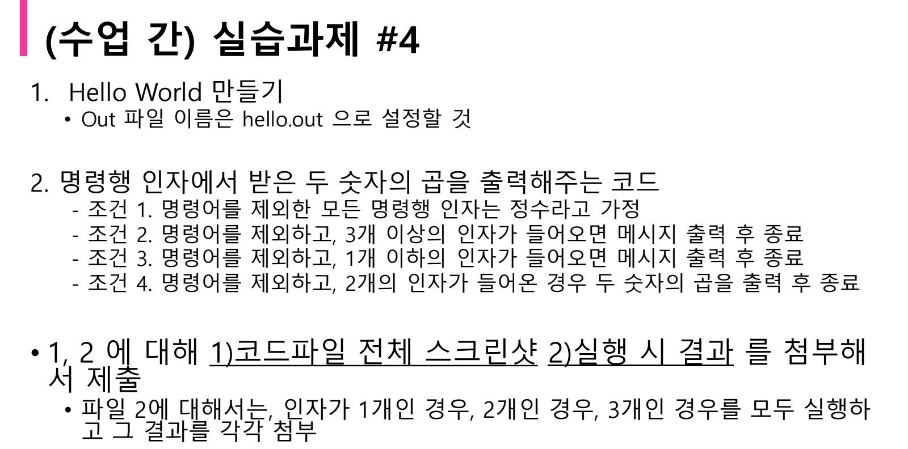

#### 1-3-2. 5번 과제

#### 1-3-3. 6번 과제

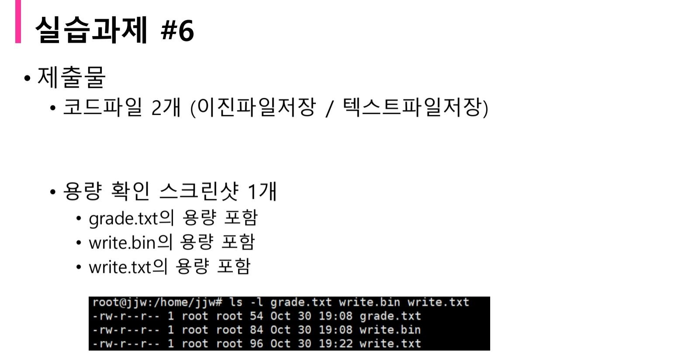

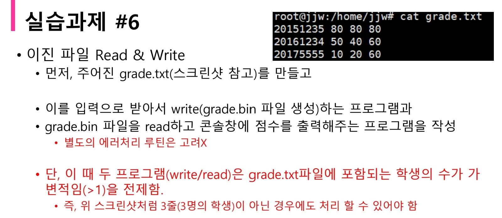
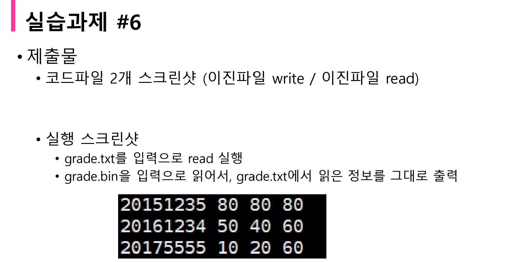

#### 1-3-4. 7번 과제

#### 1-3-5. 8번 과제

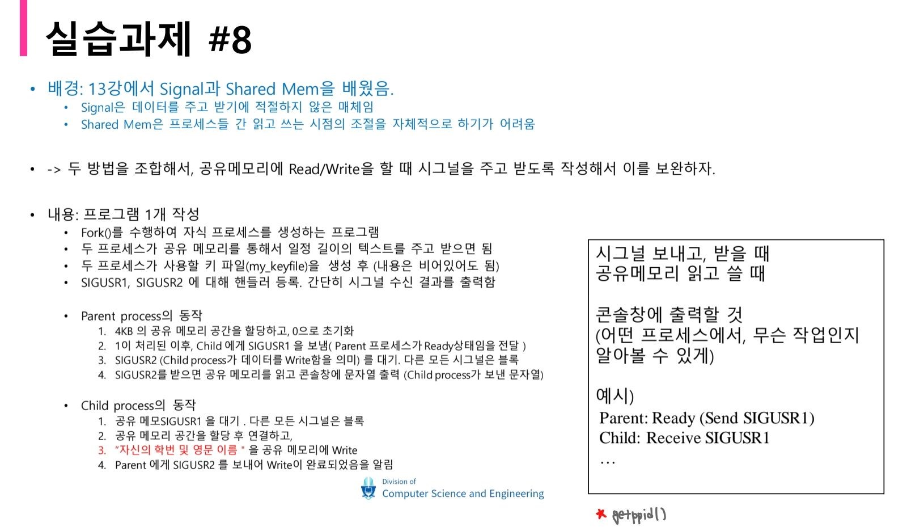
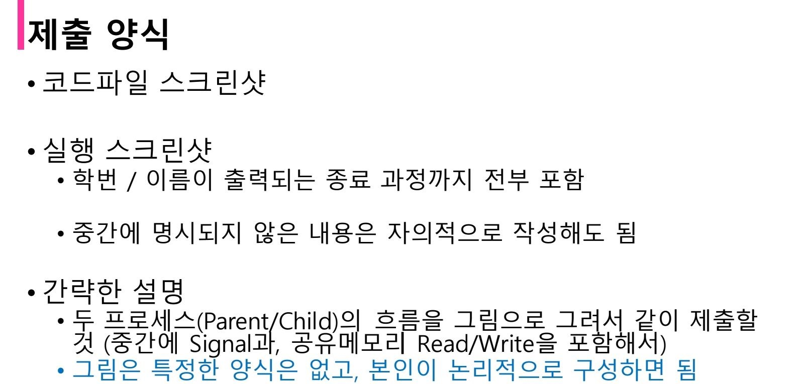
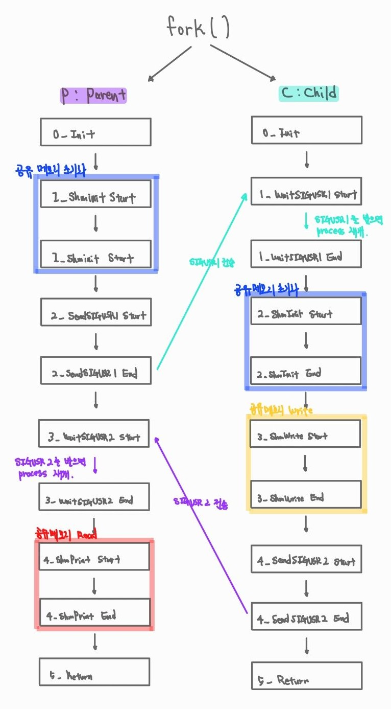

#### 1-3-6. 9번 과제

#### 1-3-7. 10번 과제

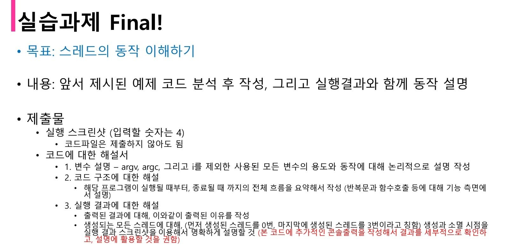

#### 1-3-8. 최종 과제

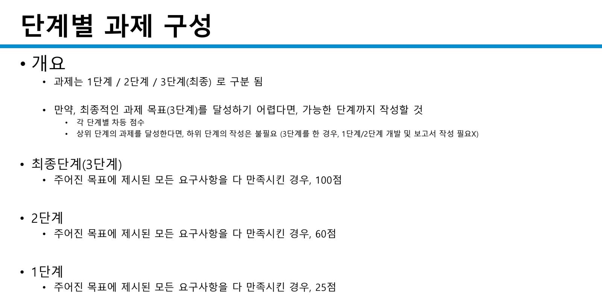

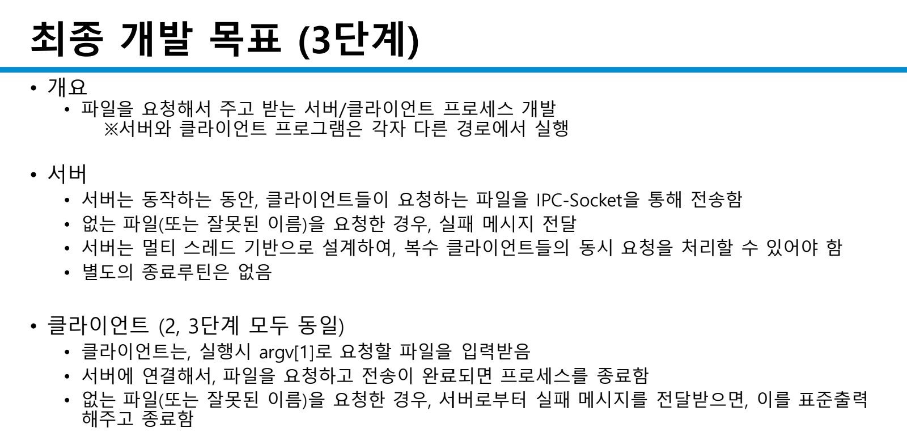

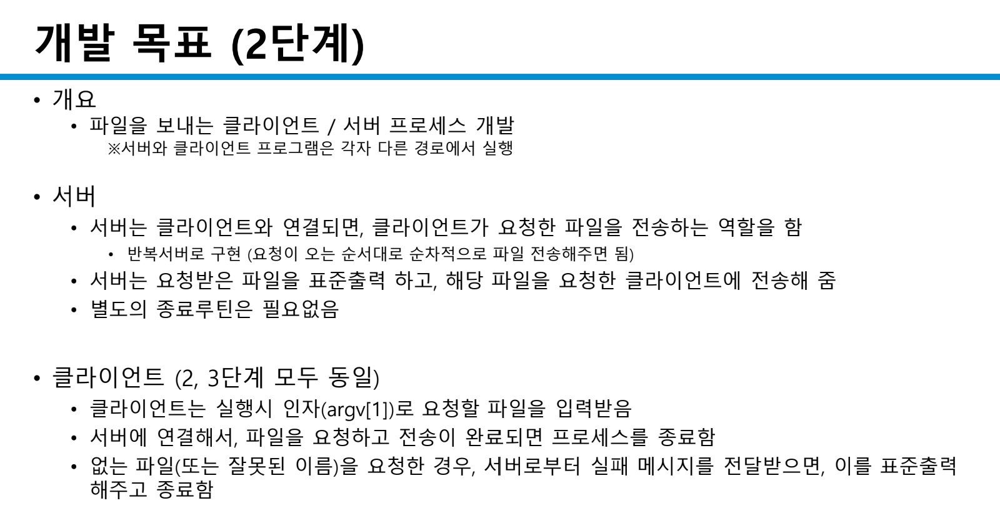
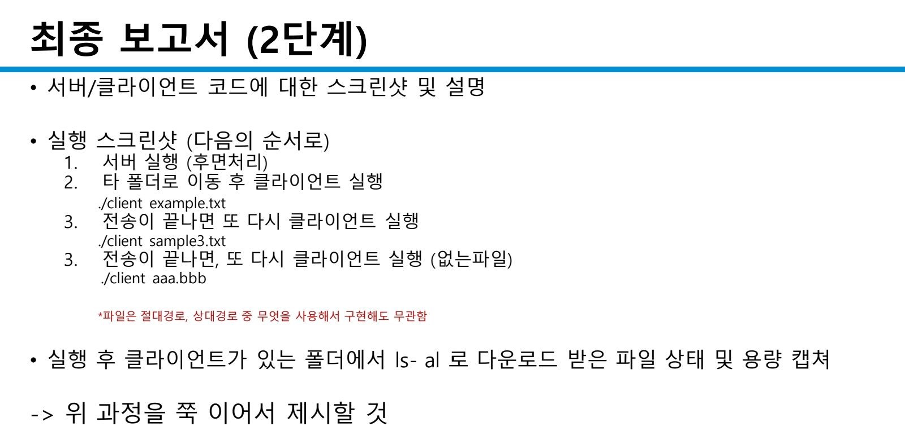
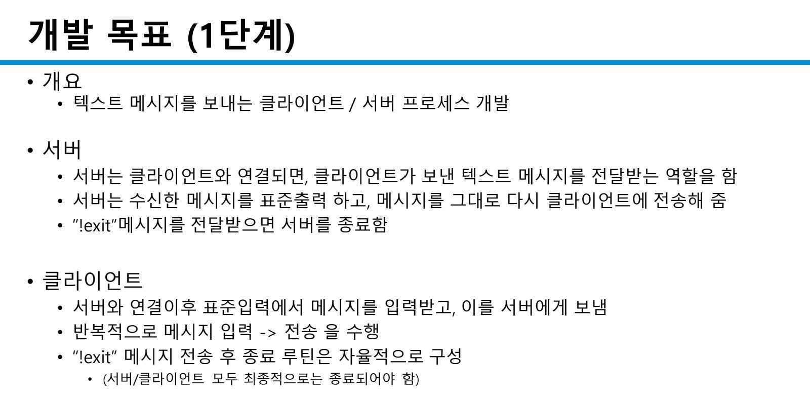
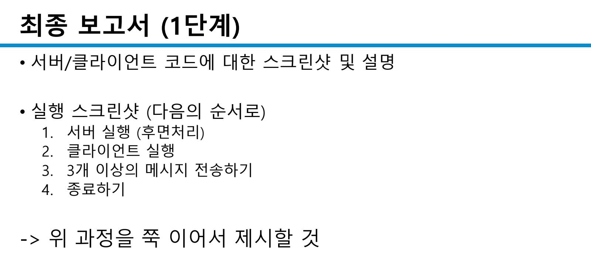
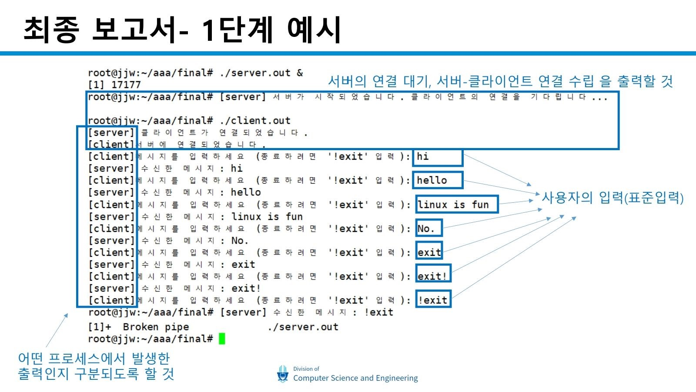

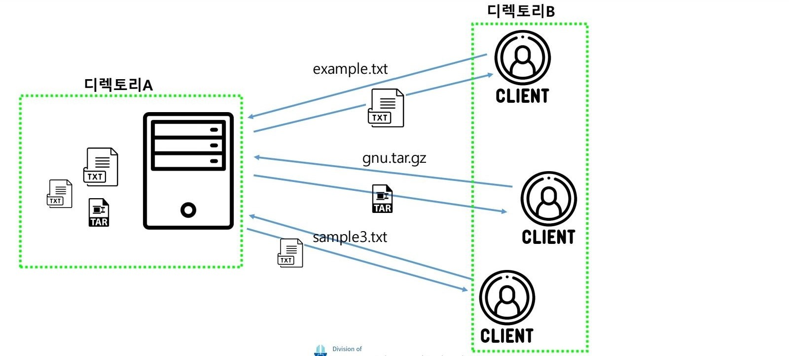
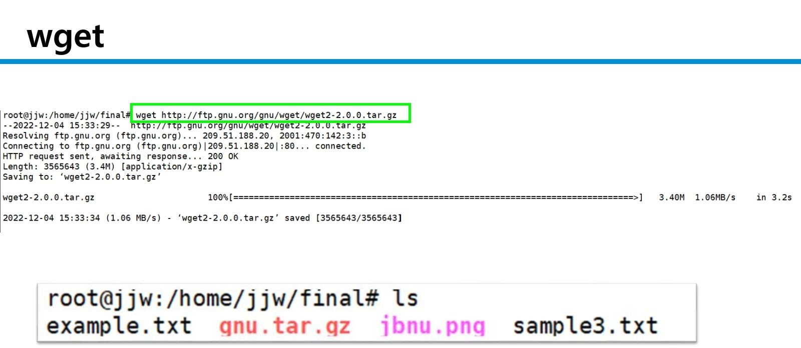

